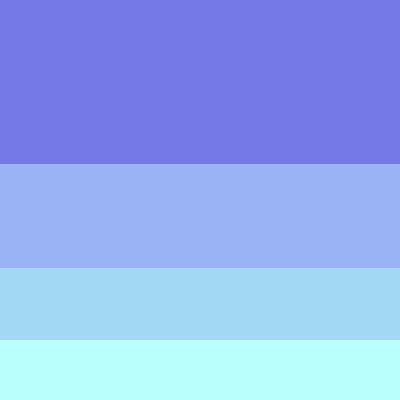

# Technical_documentation
 Description: Technical documentation of CSS

## Design
+ For the navbar I want to use the first or second color of this image:   
+ for the main content maybe I will use a white background

## Bibliography
+ [MDN Web Docs](https://developer.mozilla.org/en-US/docs/Web/CSS)  
+ [HTML Code for Common Symbols](https://www.thoughtco.com/html-code-for-common-symbols-and-signs-2654021)